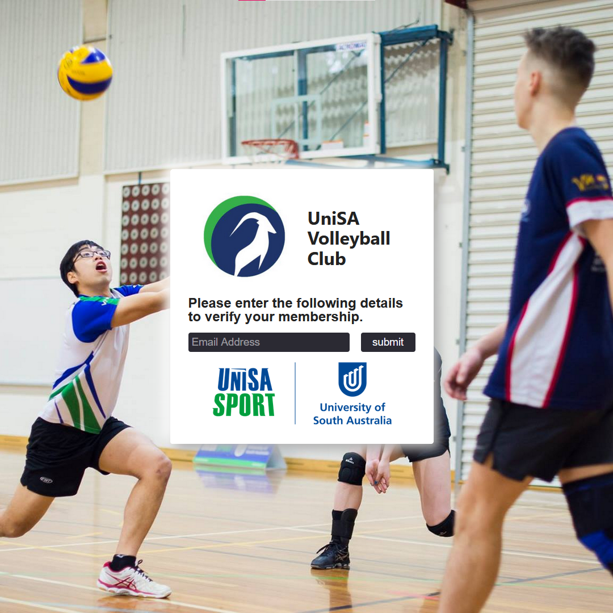

# unisa-membership-verification

[View the Project](https://connorturlan.github.io/unisa-membership-verification/)

## MVP

Allow a user to enter their email address to be securely sent and validated quickly.

Show a verification mark that is difficult to replicate and send to other users via screenshot.

<!-- ## Implementation -->

## Future Plans

-   Fine tune cookie storage.
-   Show a QR code loaded from the server to allow for quick identification with a camera scanner.

## Related Projects

-   [React File Server](https://github.com/connorturlan/file-server-react) - A File Server front-end build to work with the provided File Server.

## License

CC by attribution, commercial, derivatives allowed.

## Contributions

Made by Connor Turlan 2023.
